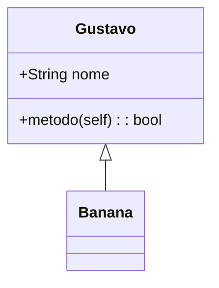

# Título da página

 

## Listas

### Não-ordenadas 

- X
- Y
- Z

### Ordenadas

1. Primeiro
2. Segundo
3. Terceiro

## Alterações de texto

**Negrito**

*Itálico*

Código - `resposta = 42`

Emoji - :snake: :rocket: :heart:

~~Tachado~~

==Realçado==

## Citação

Alguém disse:

> Essa é uma citação.

## Código

`resposta = 42` 

## Links

[DuckDuckGo](http://ddg.gg) 

## Tabela

| Nome | Idade |
| ---- | ----- |
| Gustavo | 20 |
| Maria Clara | 8 |
| Mariana | 5 |

## Lista de Tarefas

- [ ] Comer abacaxi.
- [x] Comer maçã.
- [ ] Comer melância.

## Bloco de código

```{.py3 hl_lines="1 3" linenums="1" title="meu_arquivo.py"}
def xpto():
    """Docstring."""
    return True
```

## Custom fence



## Deploy